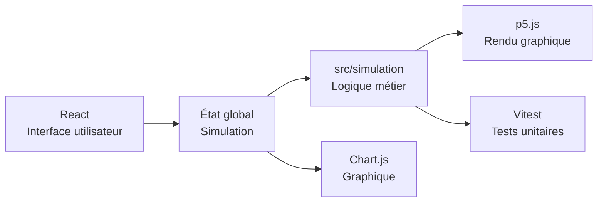

# 🧬 Patient Zero

<div align="center">

**Simulation interactive d’épidémie en React**

Configure une population, lance une propagation, observe les individus en mouvement et suis l’évolution des états sanitaires en temps réel.

<br />


</div>

---

## 📌 À propos

**Patient Zero** est une application web pédagogique de simulation d’épidémie.

Elle permet de visualiser la propagation d’une infection dans une population d’individus qui se déplacent dans une zone graphique.  
Le projet a été conçu pour rester :

- **clair** à comprendre ;
- **testable** grâce à une logique métier séparée ;
- **facilement documentable** dans un rapport de développement ou un TPI ;
- **simple à maintenir**.

> **Objectif principal :** proposer une simulation visuelle, compréhensible et configurable sans complexifier inutilement le code.

---

## 🧭 Sommaire

- [Aperçu du projet](#-aperçu-du-projet)
- [Fonctionnalités principales](#-fonctionnalités-principales)
- [Technologies utilisées](#-technologies-utilisées)
- [Installation](#-installation)
- [Lancer le projet](#-lancer-le-projet)
- [Commandes disponibles](#-commandes-disponibles)
- [Structure du dépôt](#-structure-du-dépôt)
- [Architecture technique](#-architecture-technique)
- [Modèle de simulation](#-modèle-de-simulation)
- [Tests](#-tests)
- [Intégration continue](#-intégration-continue-gitlab)
- [Déploiement](#-déploiement)
- [État actuel](#-état-actuel)
- [Licence et contexte](#-licence-et-contexte)

---

## 👀 Aperçu du projet

L’application simule une épidémie dans une population d’individus mobiles.

Chaque individu possède un état sanitaire :

| État | Description | Couleur affichée |
|---|---|---|
| `healthy` | Individu sain | 🟢 Vert |
| `infected` | Individu infecté et contagieux | 🔴 Rouge |
| `recovered` | Individu guéri | 🔵 Bleu |
| `dead` | Individu mort après infection | ⚫ Gris foncé |

La contamination dépend de plusieurs paramètres configurables :

| Paramètre | Rôle |
|---|---|
| Nombre d’individus | Définit la taille de la population |
| Patients zéro | Définit le nombre d’individus infectés au départ |
| Facteur de transmission | Influence la probabilité de contamination |
| Rayon d’infection | Définit la distance maximale de contamination |
| Durée moyenne d’infection | Définit combien de temps un individu reste infecté |
| Taux de guérison | Définit la probabilité de guérir après infection |
| Vitesse de déplacement | Influence le mouvement des individus |
| Vitesse de simulation | Accélère ou ralentit la simulation globale |

---

## ✨ Fonctionnalités principales

| Catégorie | Fonctionnalités |
|---|---|
| 🧪 Simulation | Génération d’une population, patients zéro, propagation locale |
| 🎨 Visualisation | Canvas dynamique avec p5.js, individus animés |
| 📊 Statistiques | Compteurs en temps réel et graphique d’évolution |
| 🧭 Contrôles | Démarrer, mettre en pause, reprendre, stopper et relancer |
| ⚙️ Configuration | Modification de plusieurs paramètres pendant la simulation |
| 🧱 Architecture | Séparation entre interface, rendu graphique et logique métier |
| ✅ Qualité | Tests unitaires avec Vitest, lint avec ESLint |
| 📱 Interface | Responsive pour ordinateur, tablette et mobile |
| 🚀 Build | Build de production avec Vite |

---

## 🛠️ Technologies utilisées

| Technologie | Utilisation |
|---|---|
| **React** | Interface utilisateur, composants et état global |
| **p5.js** | Rendu graphique, animation et canvas |
| **Chart.js** | Graphique d’évolution des états sanitaires |
| **Vite** | Serveur de développement et build de production |
| **Vitest** | Tests unitaires |
| **ESLint** | Vérification de la qualité du code |
| **CSS** | Mise en page, responsive et charte graphique |
| **GitLab CI** | Exécution automatique des tests sur la branche `main` |

---

## 🚀 Installation

### Prérequis

Installer **Node.js** et **npm**.

Vérifier les versions installées :

```bash
node --version
npm --version
```

Le projet a été vérifié avec un environnement Node moderne compatible avec Vite.

### Récupérer les dépendances

Depuis la racine du dépôt :

```bash
cd PatientZero
npm install
```

Pour une installation reproductible, notamment en CI :

```bash
cd PatientZero
npm ci
```

---

## ▶️ Lancer le projet

Depuis la racine du dépôt :

```bash
cd PatientZero
npm run dev
```

Vite affiche ensuite une URL locale, par exemple :

```txt
http://localhost:5173/
```

> Si le port `5173` est déjà utilisé, Vite choisira automatiquement un autre port.

---

## 📦 Commandes disponibles

Toutes les commandes doivent être exécutées dans le dossier `PatientZero/`.

| Commande | Description |
|---|---|
| `npm run dev` | Lance le serveur de développement Vite |
| `npm run build` | Génère la version de production dans `dist/` |
| `npm run preview` | Sert localement la version de production |
| `npm run lint` | Analyse le code avec ESLint |
| `npm run test` | Lance Vitest en mode interactif |
| `npm run test:run` | Lance les tests une seule fois |
| `npm run coverage` | Lance les tests avec couverture |
| `npm run deploy` | Déploie le dossier `dist/` avec `gh-pages` |

---

## ✅ Vérification complète avant rendu

Avant de considérer une modification comme terminée, exécuter :

```bash
cd PatientZero
npm run lint
npm run test:run
npm run build
```

Résultat attendu :

- aucune erreur de lint ;
- tous les tests passent ;
- le build se termine correctement.

> **Remarque :** Vite peut afficher un avertissement sur la taille du bundle JavaScript. Cet avertissement est connu et vient principalement des bibliothèques graphiques utilisées.

---

## 📁 Structure du dépôt

```txt
patient-zero/
├── Mockup/
│   ├── Patient Zero.html
│   ├── app.jsx
│   └── ...
└── PatientZero/
    ├── package.json
    ├── vite.config.js
    ├── index.html
    ├── public/
    │   ├── Logo-Patient-Zero.png
    │   └── favicon.png
    └── src/
        ├── App.jsx
        ├── main.jsx
        ├── components/
        ├── constants/
        ├── simulation/
        ├── styles/
        └── utils/
```

### Dossiers importants

| Dossier | Rôle |
|---|---|
| `PatientZero/src/components/` | Composants React de l’interface |
| `PatientZero/src/simulation/` | Logique métier testable sans React, p5.js ou Chart.js |
| `PatientZero/src/constants/` | Valeurs par défaut et états possibles |
| `PatientZero/src/styles/` | Styles globaux, layout et composants |
| `PatientZero/docs/` | Documentation technique détaillée |
| `Mockup/` | Maquette et références visuelles initiales |

---

## 🧱 Architecture technique

Le projet suit une séparation simple des responsabilités.



### React

React gère :

- l’interface ;
- les panneaux de configuration ;
- les contrôles ;
- l’état global de la simulation ;
- les statistiques ;
- l’historique transmis au graphique.

### p5.js

p5.js gère :

- le canvas ;
- le dessin des individus ;
- l’animation visuelle ;
- la boucle de rendu.

> La logique métier importante ne doit pas être cachée dans p5.js.

### Chart.js

Chart.js gère uniquement l’affichage du graphique.  
Les données viennent de React et de la logique de simulation.

### `src/simulation/`

Ce dossier contient la logique pure :

| Fichier | Rôle |
|---|---|
| `Individual.js` | Représente un individu |
| `Population.js` | Génère et gère une population |
| `infectionRules.js` | Calcule distance, infection, guérison et mortalité |
| `updateSimulation.js` | Applique une étape logique de simulation |
| `simulationCompletion.js` | Détecte la fin d’une simulation |
| `chartHistory.js` | Prépare les données du graphique |

Cette séparation permet de tester la simulation sans lancer l’interface.

---

## 🧬 Modèle de simulation

La simulation repose sur un modèle volontairement simple et lisible :

1. Une population est générée avec un nombre défini de patients zéro.
2. Les individus se déplacent dans une zone limitée.
3. Un individu infecté peut contaminer un individu sain proche.
4. La probabilité de contamination dépend de la distance, du rayon d’infection et du facteur de transmission.
5. Un individu infecté reste infecté pendant une durée configurée.
6. À la fin de l’infection, il guérit ou meurt selon le taux de guérison.
7. La simulation se termine quand il n’y a plus d’individus infectés.

> La version actuelle ne réinfecte pas les individus guéris.

---

## 🧪 Tests

Les tests unitaires se trouvent dans :

```txt
PatientZero/src/simulation/
```

Ils couvrent notamment :

| Élément testé | Exemple |
|---|---|
| Individus | Création et transitions d’état |
| Population | Génération et statistiques |
| Infection | Distance, probabilité et contamination |
| Mortalité | Passage vers l’état `dead` |
| Temps | Évolution du temps de simulation |
| Graphique | Historique des données |
| Fin de simulation | Détection de l’arrêt logique |

Commande :

```bash
cd PatientZero
npm run test:run
```

---

## 🔁 Intégration continue GitLab

Le fichier `.gitlab-ci.yml` définit deux étapes :

| Étape | Description |
|---|---|
| `test_patient_zero` | Installe les dépendances et lance les tests |
| `sync_to_github` | Synchronise la branche `main` vers GitHub si les tests passent |

La pipeline utilise l’image Docker `node:22` pour les tests.

---

## 📚 Documentation utile

Plusieurs fichiers Markdown expliquent les choix techniques :

| Document | Contenu |
|---|---|
| `CODEX.md` | Consignes principales de développement du projet |
| `SIMULATION_MODEL.md` | Modèle de données de la simulation |
| `mortality-implementation.md` | Ajout de la mortalité |
| `FixTimeBug.md` | Correction du temps de simulation |
| `RAPPORT_CODEX.md` | Rapport d’analyse et de nettoyage du code |
| `NETTOYAGE_CODEX_DEVELOPPEMENT.md` | Résumé de nettoyage à la première personne |
| `PatientZero/docs/` | Documentation ciblée sur certaines fonctionnalités |

---

## 🤝 Bonnes pratiques pour contribuer

Avant de modifier le projet :

1. Lire `CODEX.md`.
2. Garder le code simple et compréhensible.
3. Ne pas mélanger logique métier et rendu graphique.
4. Ne pas ajouter de dépendance sans raison claire.
5. Modifier uniquement ce qui est nécessaire.
6. Ajouter ou adapter les tests si la logique métier change.
7. Exécuter lint, tests et build avant de terminer.

---

## 🚢 Déploiement

Le projet contient une configuration `homepage` et un script `deploy` utilisant `gh-pages`.

### Build de production

```bash
cd PatientZero
npm run build
```

### Preview locale du build

```bash
npm run preview
```

### Déploiement GitHub Pages

```bash
npm run deploy
```

---

## 📍 État actuel

Le projet contient déjà les fonctionnalités principales :

- simulation visuelle ;
- propagation ;
- guérison ;
- mortalité ;
- graphique ;
- contrôles ;
- tests unitaires.

### Améliorations possibles

| Amélioration | Objectif |
|---|---|
| Messages de validation plus détaillés | Mieux guider l’utilisateur |
| Optimisation de la recherche de voisins | Améliorer les performances avec une grande population |
| Découpage du bundle | Réduire la taille JavaScript si nécessaire |
| Mise à jour des anciens documents | Mentionner l’état `dead` partout où c’est utile |
| Captures d’écran dans ce README | Améliorer la présentation visuelle du projet |

---

## 📄 Licence et contexte

Ce projet est une application pédagogique de simulation d’épidémie réalisée dans le cadre d’un travail de développement.

Le dépôt est marqué comme privé dans `package.json`.

---

<div align="center">

**Patient Zero** — Simulation visuelle, pédagogique et testable d’une propagation épidémique.

</div>
